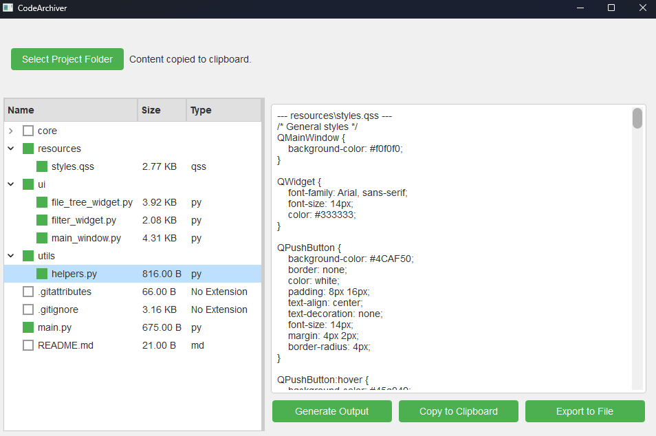

# CodeArchiver

CodeArchiver is a lightweight tool designed to help you browse, filter, and archive selected files from a project directory into a single consolidated text output. The application is built using PyQt6, offering an intuitive GUI to select files and directories, apply filters, and generate an archive of the selected content.



## Features

- **File System Navigation**: Browse through your project directory, view files and directories, and select files to include in the archive.
- **Filtering**: Apply filters to include or exclude files based on file types, ignore patterns, or specific search terms.
- **Archiving**: Generate an archive of the selected files, with options to display text content, handle binary files, and export the archive to a text file.
- **Styling**: The app includes a custom stylesheet for a modern and clean user interface.

## Installation

1. **Clone the repository**:

   ```bash
   git clone https://github.com/airobinnet/CodeArchiver.git
   cd CodeArchiver
   ```

2. **Set up the virtual environment** (optional but recommended):

   ```bash
   python3 -m venv venv
   source venv/bin/activate  # On Windows, use `venv\Scripts\activate`
   ```

3. **Install the required dependencies**:

   ```bash
   pip install -r requirements.txt
   ```

4. **Run the application**:

   ```bash
   python main.py
   ```

## Usage

### Selecting a Project Folder

1. Click on the `Select Project Folder` button.
2. Choose the directory you want to archive files from.

### Navigating the File Tree

- The file tree on the left displays the contents of the selected project directory.
- You can expand/collapse directories and check/uncheck files to select them for archiving.

### Applying Filters

- Use the filter options on the right side to:
  - Specify file types (e.g., `.py`, `.txt`) you want to include.
  - Add or remove ignore patterns (e.g., `*.log`, `__pycache__`).
  - Search for specific filenames or parts of filenames.

### Generating the Archive

1. After selecting the files, click on the `Generate Output` button.
2. The content of the selected files will be displayed in the output text area on the right.

### Copying or Exporting the Archive

- **Copy to Clipboard**: Click the `Copy to Clipboard` button to copy the generated archive content.
- **Export to File**: Click the `Export to File` button to save the archive content to a `.txt` file.

## File Structure

```plaintext
CodeArchiver/
│
├── core/
│   ├── archiver.py         # Core logic for generating archive content.
│   ├── file_system.py      # Utility functions to interact with the file system.
│   └── filters.py          # Functions to apply various filters to the file list.
│
├── ui/
│   ├── file_tree_widget.py # Widget for displaying and interacting with the file tree.
│   ├── filter_widget.py    # Widget for filtering file selection.
│   └── main_window.py      # Main window of the application.
│
├── resources/
│   └── styles.qss          # QSS file containing styles for the application.
│
├── utils/
│   └── helpers.py          # Helper functions for various utilities.
│
├── main.py                 # Entry point of the application.
└── requirements.txt        # List of required dependencies.
```

## Customization

### Stylesheet

- The application uses a custom QSS file (`resources/styles.qss`) for styling. You can modify this file to customize the look and feel of the application.

### Adding More Filters

- Filters for file selection are implemented in `core/filters.py`. You can extend or modify these filters to suit specific needs.

## Contributing

Contributions are welcome! If you have suggestions or find issues, feel free to open an issue or submit a pull request.

## License

This project is licensed under the MIT License. See the [LICENSE](LICENSE) file for more details.